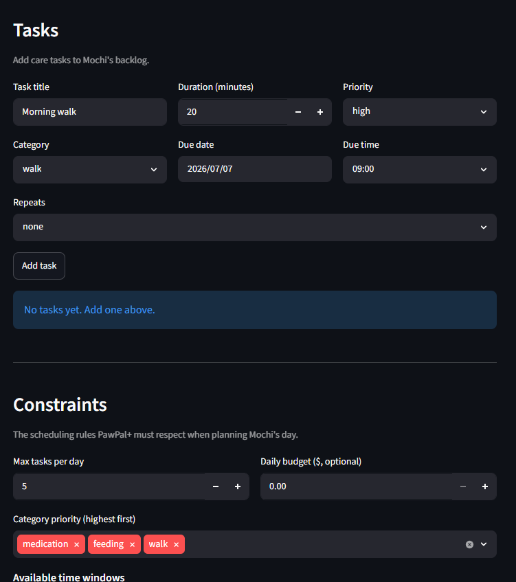

# PawPal+ (Module 2 Project)

You are building **PawPal+**, a Streamlit app that helps a pet owner plan care tasks for their pet.

## Scenario

A busy pet owner needs help staying consistent with pet care. They want an assistant that can:

- Track pet care tasks (walks, feeding, meds, enrichment, grooming, etc.)
- Consider constraints (time available, priority, owner preferences)
- Produce a daily plan and explain why it chose that plan

Your job is to design the system first (UML), then implement the logic in Python, then connect it to the Streamlit UI.

## What you will build

Your final app should:

- Let a user enter basic owner + pet info
- Let a user add/edit tasks (duration + priority at minimum)
- Generate a daily schedule/plan based on constraints and priorities
- Display the plan clearly (and ideally explain the reasoning)
- Include tests for the most important scheduling behaviors

## Getting started

### Setup

```bash
python -m venv .venv
source .venv/bin/activate  # Windows: .venv\Scripts\activate
pip install -r requirements.txt
```

### Suggested workflow

1. Read the scenario carefully and identify requirements and edge cases.
2. Draft a UML diagram (classes, attributes, methods, relationships).
3. Convert UML into Python class stubs (no logic yet).
4. Implement scheduling logic in small increments.
5. Add tests to verify key behaviors.
6. Connect your logic to the Streamlit UI in `app.py`.
7. Refine UML so it matches what you actually built.

## 🖥️ Sample Output


```
=== Today's Schedule ===

pet1 (dog):
Plan for 2026-07-07:
Selected 2 of 2 due task(s) for pet1. Ordered by priority: exercise, feeding, health. Respecting a daily cap of 5 task(s).
- Evening Walk at 18:00 (30 min, priority 2, category exercise)
- wake up at 08:00 (30 min, priority 1, category daily task)

pet2 (cat):
Plan for 2026-07-07:
Selected 1 of 1 due task(s) for pet2. Ordered by priority: eat, sleep, water. Respecting a daily cap of 2 task(s).
- Feed Cat at 09:00 (10 min, priority 3, category feeding)
```

## 🧪 Testing PawPal+
My confidence level is 4 based off of the test results.
```bash
# Run the full test suite:
python -m pytest

# Run with coverage:
pytest --cov
```

Sample test output:

```
platform win32 -- Python 3.13.14, pytest-9.1.1, pluggy-1.6.0
rootdir: C:\Users\lnini\OneDrive\Desktop\codepath AI110\PawPal
plugins: anyio-4.14.1
collected 36 items                                                                                                                               

test\test_pawpal.py ....................................                                                                                   [100%]
```

## 📐 Smarter Scheduling

The scheduling "brain" is `Pet.generate_daily_plan`, which runs four stages: filter → sort → cap → detect conflicts. Each stage maps to the methods below.

| Feature | Method(s) | Notes |
|---------|-----------|-------|
| Task sorting | `Pet.generate_daily_plan` (inner `sort_key`), `Task.sort_by_time` | Selection order ranks by constraint category priority, then task priority (higher first), then earliest due time, then `task_id`. `Task.sort_by_time` re-orders the chosen tasks chronologically for display. |
| Filtering | `Pet.generate_daily_plan` (inner `is_eligible`), `Owner.tasks_for_pet` | Keeps only uncompleted tasks due on the plan date that fall inside an available `TimeWindow`. Filtering runs *before* the `max_daily_tasks` cap so an out-of-window task can't steal a limited daily slot. |
| Conflict handling | `detect_time_conflicts`, `Task.conflicts_with`, `Owner.detect_conflicts` | Half-open `[due_time, end_time)` overlap check (back-to-back tasks don't clash; same start always does). Reported as non-fatal warnings — same-pet conflicts per plan, cross-pet conflicts via the owner. |
| Recurring tasks | `Task.is_recurring`, `Task.next_occurrence`, `Task.mark_completed`, `Pet.complete_task` | Completing a `"daily"`/`"weekly"` task auto-spawns a fresh copy for the next occurrence (completion date + one interval, `RECURRENCE_DELTAS`) and adds it back to the backlog; one-off tasks just mark done. |

## 📸 Demo Walkthrough

Featers
- Sorting: task are ordered choronologically by due time
- Filtering: get all task for one pet 
- Conflict warnings: if two task aare overllapping it will get flagged
- Constraint-aware planning: plans around your constraints


Describe your app in numbered steps so a reader can follow along without watching a video:

1. Add in your personal info
2. Add your pet info
3. Add constraints and task for your pet
4. Repeat this with each pet
5. Generate a daily plan!
6. View the plan and edit if needed

**Screenshot or video** *(optional)*: <!-- Insert a screenshot or link to a demo video here -->
